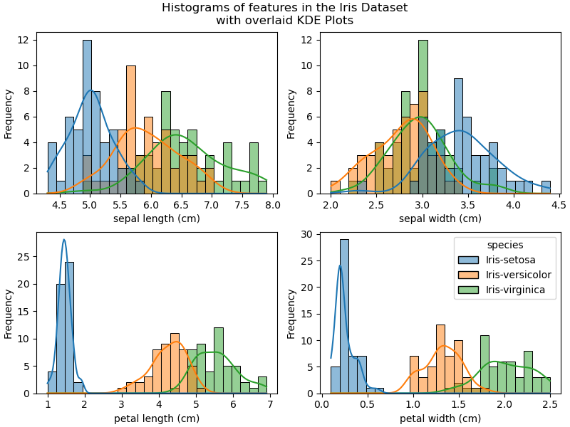
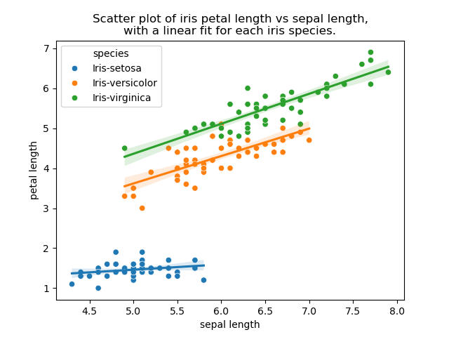
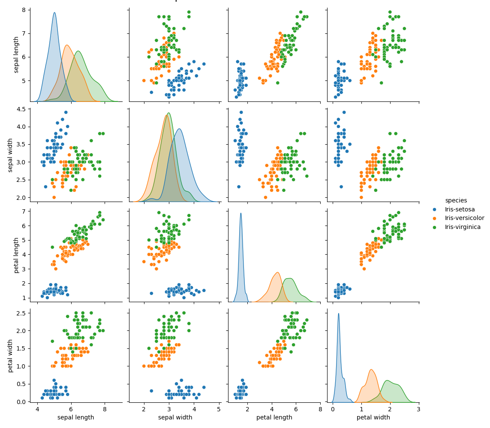
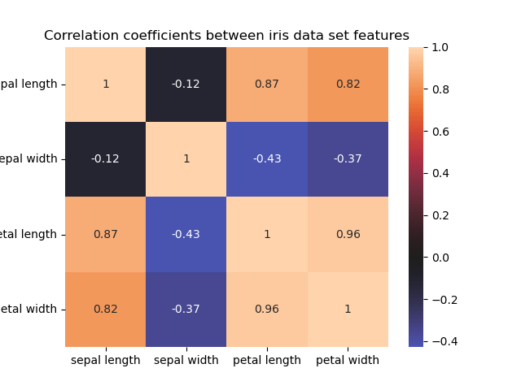

# pands-project
Assessed project for the Programming and Scripting module, part of the 
Higher Diploma in Data Analytics course at Atlantic Technological University, 
Ireland, Spring 2025 

Author: Susan Collins

## Description of this repository

This repository comprises files containing [Fisher's Iris data set](https://en.wikipedia.org/wiki/Iris_flower_data_set), a Python program that performs exploratory data analysis on the data set, and a Jupyter notebook that explains and provides references for the code in this program. 

These files have been produced as part of an assessment for the Programming and Scripting module, part of the Higher Diploma in Data Analytics, at Atlantic Technological University, Ireland, Spring 2025.

The brief for this project is listed here: [Project 2025.pdf](https://github.com/andrewbeattycourseware/pands-courseware/blob/main/labs/Project%202025.pdf)

## Files in this repository
[README.md](https://github.com/SuColl/pands-project/blob/main/README.md)  - this file

[.gitignore](https://github.com/SuColl/pands-project/blob/main/.gitignore) - a standard Git configuration file to prevent the upload of unnecessary files to the repository

[requirements.txt](https://github.com/SuColl/pands-project/blob/main/requirements.txt) - a list of Python libraries required to run the code in the Juypter notebook

[bezdekiris.data](https://github.com/SuColl/pands-project/blob/main/bezdekIris.data) - the Iris data set, downloaded from the [UC Irving Machine Learning Repository](https://archive.ics.uci.edu/dataset/53/iris). This is the version corrected after [Bezdek et. al. (1999)](https://doi.org/10.1109/91.771092).

[analysis.py](https://github.com/SuColl/pands-project/blob/main/analysis.py) - a Python program that reads in the Iris data file and produces a text file summarising the statistical characteristics of the data features, and several plots of the data features. 

[commentary.ipynb](https://github.com/SuColl/pands-project/blob/main/commentary.ipynb) - a Jupyter notebook which breaks down the code in analysis.py, providing explanations, comments and references.

Outputs of analysis.py:
- [iris_stats.txt](https://github.com/SuColl/pands-project/blob/main/iris_stats.txt) - a text file
- [plot01_histograms_of_iris_features.png](https://github.com/SuColl/pands-project/blob/main/plot01_histograms_of_iris_features.png) - a multipart plot of the distribution of data points for each measurement of the iris flowers, separated by species
- [plot02_scatterplot_petal_length_vs_sepal_length.png](https://github.com/SuColl/pands-project/blob/main/plot02_scatterplot_petal_length_vs_sepal_length.png) - a scatter plot of iris petal length ve sepal length, with a linear fit displayed for each species' data points,
- [plot03_pairplot.png](https://github.com/SuColl/pands-project/blob/main/plot03_pairplot.png) - a 4x4 pairplot of each feature in the dataset
- [plot04_heatmap.png](https://github.com/SuColl/pands-project/blob/main/plot04_heatmap.png) - a heatmap of the Pearson correlation coefficient for each pair of features in the dataset.

## Expected output of analysis.py
### [iris_stats.txt](https://github.com/SuColl/pands-project/blob/main/iris_stats.txt)
```
Iris Dataset Feature Statistics - All Data
       sepal length  sepal width  petal length  petal width
count    150.000000   150.000000    150.000000   150.000000
mean       5.843333     3.057333      3.758000     1.199333
std        0.828066     0.435866      1.765298     0.762238
min        4.300000     2.000000      1.000000     0.100000
25%        5.100000     2.800000      1.600000     0.300000
50%        5.800000     3.000000      4.350000     1.300000
75%        6.400000     3.300000      5.100000     1.800000
max        7.900000     4.400000      6.900000     2.500000

Iris Dataset Feature Statistics - Grouped By Species
species             Iris-setosa  Iris-versicolor  Iris-virginica
sepal length count    50.000000        50.000000       50.000000
             mean      5.006000         5.936000        6.588000
             std       0.352490         0.516171        0.635880
             min       4.300000         4.900000        4.900000
             25%       4.800000         5.600000        6.225000
             50%       5.000000         5.900000        6.500000
             75%       5.200000         6.300000        6.900000
             max       5.800000         7.000000        7.900000
sepal width  count    50.000000        50.000000       50.000000
             mean      3.428000         2.770000        2.974000
             std       0.379064         0.313798        0.322497
             min       2.300000         2.000000        2.200000
             25%       3.200000         2.525000        2.800000
             50%       3.400000         2.800000        3.000000
             75%       3.675000         3.000000        3.175000
             max       4.400000         3.400000        3.800000
petal length count    50.000000        50.000000       50.000000
             mean      1.462000         4.260000        5.552000
             std       0.173664         0.469911        0.551895
             min       1.000000         3.000000        4.500000
             25%       1.400000         4.000000        5.100000
             50%       1.500000         4.350000        5.550000
             75%       1.575000         4.600000        5.875000
             max       1.900000         5.100000        6.900000
petal width  count    50.000000        50.000000       50.000000
             mean      0.246000         1.326000        2.026000
             std       0.105386         0.197753        0.274650
             min       0.100000         1.000000        1.400000
             25%       0.200000         1.200000        1.800000
             50%       0.200000         1.300000        2.000000
             75%       0.300000         1.500000        2.300000
             max       0.600000         1.800000        2.500000

Iris Dataset Mean and Medians - Grouped By Species
                 sepal length  sepal width  petal length  petal width
species                                                              
Iris-setosa             5.006        3.428         1.462        0.246
Iris-versicolor         5.936        2.770         4.260        1.326
Iris-virginica          6.588        2.974         5.552        2.026
```
### [plot01_histograms_of_iris_features.png](https://github.com/SuColl/pands-project/blob/main/plot01_histograms_of_iris_features.png)


### [plot02_scatterplot_petal_length_vs_sepal_length.png](https://github.com/SuColl/pands-project/blob/main/plot02_scatterplot_petal_length_vs_sepal_length.png)


### [plot03_pairplot.png](https://github.com/SuColl/pands-project/blob/main/plot03_pairplot.png)


### [plot04_heatmap.png](https://github.com/SuColl/pands-project/blob/main/plot04_heatmap.png)



## Technologies used in the creation of this repository
- Python v3.12.7
- Git
- GitHub
- Jupyter
